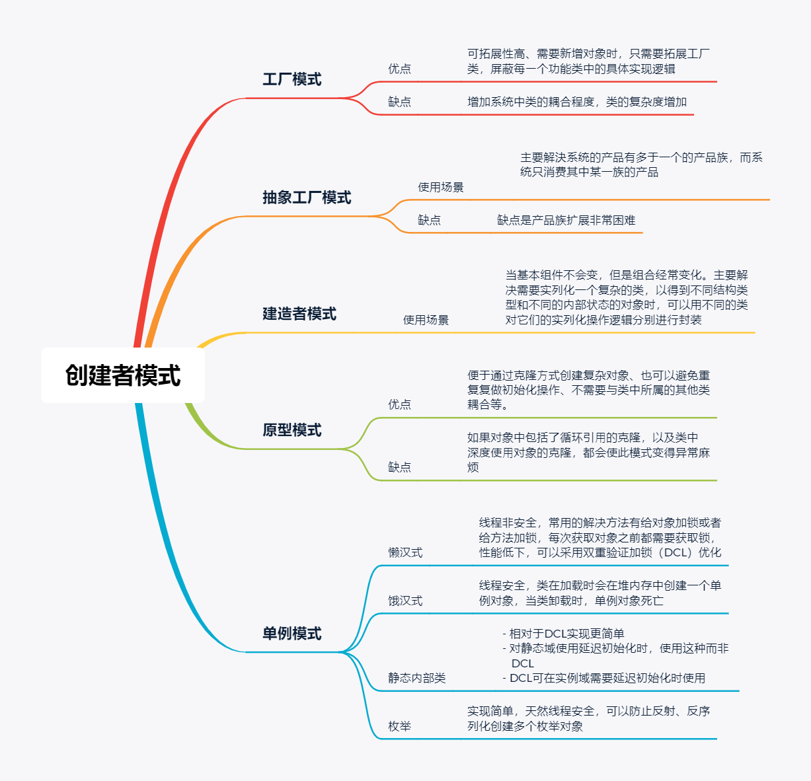
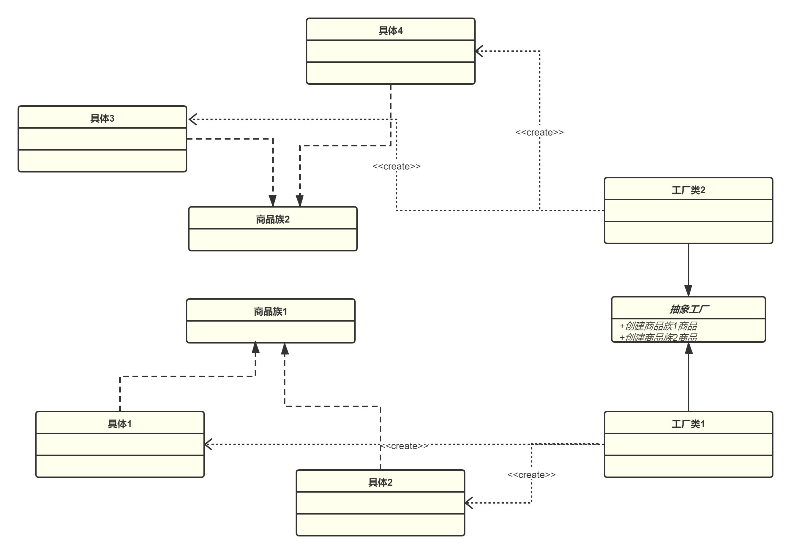
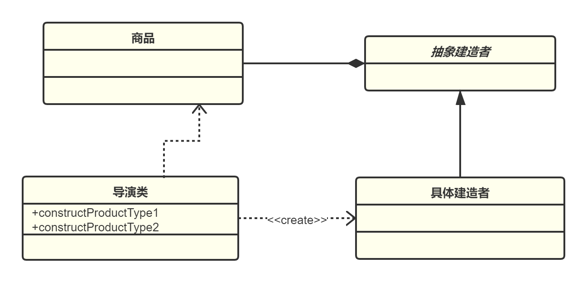

## 背景

在很多人的认知里，算法就像是单兵的作战能力和武器装备，而设计模式更像打仗列的阵型。而且随着工作时间的推移，很多开发者长时间浸淫在繁杂的业务之中，担心自己技术跟不上时代的时候，都会去看一些框架源码来拓展自己的技术深度。但基本所有的框架里面都应用了很多的设计模式，如果你对设计模式不理解的话，往往会有这种感觉 -- 这段代码，我好像看懂了，又好像没看懂。

学好设计模式，不光是对我们阅读源码的时候有帮助，在面对复杂业务逻辑的时候，也可以更好的去设计代码，而不是用一堆 `if-else` 去实现各种场景的业务功能。试想一下，你工作之中，你写好的设计模式被其他同事用的时候，只需要传递简单的参数就能实现业务拓展，是不是又低调的装了X又造福了后人。

最近我也在重新学习设计模式，所有的样例代码都整理在我的 [仓库链接](https://github.com/liujiang157/design-pattern-study) 中，在最近几天学习完所有的创建者模式后，整理了一下。





## 六大原则

设计模式遵循六⼤原则；单⼀职责( ⼀个类和⽅法只做⼀件事 )、⾥⽒替换原则( 多态，⼦类可扩展⽗类 )、依赖倒置( 细节依赖抽象，下层依赖上层 )、接⼝隔离( 建⽴单⼀接⼝ )、迪⽶特原则( 最少知道，降低耦合 )、开闭原则( 抽象架构，扩展实现 )。

> 引用自《重学Java设计模式》

## 工厂模式

工厂模式主要分为三种：

- 简单工厂模式
- 工厂方法模式
- 抽象工厂模式

### 简单工厂

简单工厂主要是屏蔽对象的对实现逻辑，并且通过对公共的接口提供对象的实例化的服务，这样添加新类的时候，只需要在工厂类中修改一点代码即可。


在这个简单工厂里面，如果要创建商品 PC、商品 Mouse 以及商品 KeyBoard，我们要创建商品的时候只要调用简单工厂里面的创建商品方法，根据类型创建出不同的商品然后实列化返回就可以了。

现在来直接看一下简单工厂的例子

```java
public class ProductFactory {

    public static IProduct createProduct(ProductEnum productEnum) {
        if (ProductEnum.MOUSE == productEnum) return new MouseProduct();
        if (ProductEnum.KEYBOARD == productEnum) return new KeyBoardProduct();
        if (ProductEnum.PC == productEnum) return new PCProdcuct();
        throw new IllegalArgumentException("没有这种商品类型");
    }
}
```
现在来测试一下:
```java
@Test
public void testSimpleFactory() {
    // 1. 鼠标
    ProductFactory.IProduct mouseProduct = ProductFactory.createProduct(ProductFactory.ProductEnum.MOUSE);
    Assert.assertEquals("我是鼠标", mouseProduct.printMessage());
    // 2. 键盘
    ProductFactory.IProduct keyboardProduct = ProductFactory.createProduct(ProductFactory.ProductEnum.KEYBOARD);
    Assert.assertEquals("我是键盘", keyboardProduct.printMessage());
    // 3. 电脑
    ProductFactory.IProduct pcProduct = ProductFactory.createProduct(ProductFactory.ProductEnum.PC);
    Assert.assertEquals("我是电脑", pcProduct.printMessage());
}
```
这种实现方式可以良好的实现避免创建者与具体的产品逻辑耦合、满足单一职责，每⼀个业务逻辑实现都在所属⾃⼰的类中完成。但是如果需要新增产品的时候，就要去修改 createProduct 这个方法，每次新增一个产品，都需要添加一个 `if` 判断。而且随着商品类的增加，看起来这样就不满足开闭原则了。

如果非要满足开闭原则的话，可以将 productEnum 改成传递类名,这里我都没有传递参数，如果需要传递参数的话 getConstructor 可以添加每个参数的参数类型，newInstance 中可以添加所有的参数。但是反射不当是容易导致线上机器出问题的，因为我们反射创建的对象属性是被 SoftReference 软引用的,所以当</br>`-XX:SoftRefLRUPolicyMSPerMB` 没有设置好的话会一直让机器CPU很高。<sup>[1]<sup/>

```java
public static IProduct createProduct(String className) throws Exception {
    return (IProduct) Class.forName(className).getConstructor().newInstance();
}
```

工厂方法模式是直接将工厂类抽象化，需要具体特定化的逻辑代码转移到实现抽象方法的子类中，这样就不要再去修改工厂类，省去了 `if-else` 的修改，也是另一种满足开闭原则的实现。


这样当出现其他类型的时候，也只要去继承我们创建的工厂方法可以了。

### 抽象工厂

抽象工厂很像工厂方法的延伸，工厂方法类中只有一个抽象方法，要想实现多种不同的类对象，只能去创建不同的具体工厂方法的子类来实列化，而抽象工厂则是让一个工厂负责创建多个不同类型的对象。



这样我们就可以直接通过抽象工厂，获取不同类型的商品对象了。在抽象工厂可以定义获取不同类型商品的方法。

```java
public abstract class AbstractFactory {

    public abstract IFlower getFlower(Enum<FlowerEnum> productEnum);

    public abstract IMelon getMelon(Enum<MelonEnum> productEnum);
}
```
这样每个子工厂只要专注于实现自己负责的产品即可。
```java
public class FlowerFactory extends AbstractFactory{

    @Override
    public FlowerFactory.IFlower getFlower(Enum<FlowerEnum>  productEnum) {
        if (FlowerEnum.ROSE == productEnum) return new Rose();
        if (FlowerEnum.LILY == productEnum) return new Lily();
        if (FlowerEnum.TULIP == productEnum) return new Tulip();
        return null;
    }

    @Override
    public MelonFactory.IMelon getMelon(Enum<MelonEnum>  productEnum) {
        throw new IllegalArgumentException("无法通过本工厂获取该类型对象");
    }
}
```
抽象工厂还有一个生成器类。如果把每个子工厂都看做一个商品的话，这个类就有点类似于简单工厂的工厂类，如果通过这个生成器类可以获取具体的子工厂类，然后创建对象。

```java
public class FactoryProducer {

    public static AbstractFactory getFactory(FactoryEnum factoryEnum) {
        if (factoryEnum == FactoryEnum.FLOWER) return new FlowerFactory();
        if (factoryEnum == FactoryEnum.MELON) return new MelonFactory();
        return null;
    }
}
enum FactoryEnum {
    FLOWER, MELON
}

```
下面也展示一下抽象工厂的使用方法。
```java
@Test
public void testAbstractFactory() {
    // 通过生成器获取鲜花工厂
    AbstractFactory flowerFactory = FactoryProducer.getFactory(FactoryEnum.FLOWER);
    // 构造蓝色妖姬
    AbstractFactory.IFlower flower = flowerFactory.getFlower(FlowerFactory.FlowerEnum.ROSE);
    Assert.assertEquals("我是蓝色妖姬", flower.getColor());
    // 通过生成器获取瓜工厂
    AbstractFactory melonFactory = FactoryProducer.getFactory(FactoryEnum.MELON);
    //构造西瓜
    AbstractFactory.IMelon melon = melonFactory.getMelon(MelonFactory.MelonEnum.WATER);
    Assert.assertEquals("我是西瓜", melon.getVariety());
}
```

## 单例模式

单例模式是指在内存中只会创建且仅创建一次对象的设计模式。在程序中多次使用同一个对象且作用相同时，为了防止频繁地创建对象使得内存飙升，单例模式可以让程序仅在内存中创建一个对象，让所有需要调用的地方都共享这一单例对象。

常见的单例模式主要有4种类型：
- 懒汉式单例模式
- 饿汉式单例模式
- 静态内部类单例模式
- 枚举的单例模式

### 懒汉式的单例模式

懒汉式只在程序第一次调用的时候创建对象，所以需要调用的时候需要判断是否已经实例化该对象，如果未实例化，则实例化该对象。

```java
public class LazySingleTon {
    private static LazySingleTon singleTon;

    private LazySingleTon() {
    }

    public static LazySingleTon getInstance() {
        if (singleTon == null) {
            singleTon = new LazySingleTon();
        }
        return singleTon;
    }
}
```
懒汉的构建方式如果在同时存在多个线程的情况下，线程1在判断了 singleTon==null 后让出了 cpu 的使用权，而线程二这时候获取到了 cpu 的使用权，也判断了一次 singleTon==null 那么线程2就会执行 singleTon = new LazySingleTon()，当线程1重新获取到 cpu 的使用权之后，因为他刚判断了 singleTon 是 null ，所以线程1也会创建一个 LazySingleTon 的实例。所以就存在了 `线程安全` 的问题。

下面写个测试用例来测试懒汉的线程不安全,这个用例不是百分百成功的，但是我试了一下，基本都是成功的，而且只要成功一次就能说明懒汉不是线程安全的：

```java
@Test
public void testLazyThread(){

    ExecutorService threadpool = Executors.newFixedThreadPool(50);
    List<Integer> list = new ArrayList<>();
    for (int i = 0; i < 100; i++) {
        threadpool.execute(() -> list.add(LazySingleTon.getInstance().hashCode()));
    }
    //如果不止有一个hashcode 说明线程不安全
    Assert.assertNotEquals(1, list.stream().distinct().count());
}
```

### 饿汉式的单例模式

饿汉式在类加载的时候就已经初始化好该对象，后续程序调用的都是该对象。

```java
public class HungrySingleTon {

    private static HungrySingleTon singleTon = new HungrySingleTon();
    
    private HungrySingleTon(){}

    public static HungrySingleTon getInstance(){
        return singleTon;
    }
    
}
```
这样类在加载时会在堆内存中创建一个 HungrySingleTon 对象，当类被卸载时，HungrySingleTon 对象也就会被随之死亡了。

### 懒汉单例优化

上面已经提过了，懒汉式的单例存在线程安全问题，那最简单的方法就是加锁，给类对象加锁或者给方法加锁。

```java
//给方法加锁
public synchronized static LazySycnMethodSingleTon getInstance() {
        if (singleTon == null) {
            singleTon = new LazySycnMethodSingleTon();
        }
        return singleTon;
    }

//给类对象加锁
public static LazySycnClaszSingleTon getInstance() {
        synchronized (LazySycnClaszSingleTon.class) {
            if (singleTon == null) {
                singleTon = new LazySycnClaszSingleTon();
            }
        }
        return singleTon;
    }
```
但上面两种方法都存在一个问题，在获取对象之前都要先获取锁，所以并发性能就显得尤其的低下。比较典型的方案是双重校验加锁（Double Check and Lock）。
```java
public class LazySingleTon {
    private static volatile LazySingleTon singleTon;

    private LazySingleTon(){}

    public static LazySingleTon getInstance(){
        if(singleTon ==null)
            synchronized (LazySingleTon.class) {
                if (singleTon == null) {
                    singleTon = new LazySingleTon();
                }
            }
        return singleTon;
    }

}
```
第一个 if(singleTon ==null) ，当对象已经被实例化之后，直接获取对象。如果第一个 if(singleTon ==null) 为 true 时，也就是没有实例化对象时，为避免此时有多个线程来实例这个资源，对类对象施加锁。

在 DCL 中声明 singleTon 对象的时候，添加了 volatile 修饰词。原因是因为 JVM 在创建对象的时候，可以对指令进行重排序以提高程序性能。JVM 在创建对象的时候，一般会经过以下三个步骤：

1. 分配内存空间
2. 初始化对象
3. 将对象指向分配好的内存空间

但是在 2 和 3 的时候有可能出现指令重排。比如多个线程，当线程1执行了 1-3 而正在初始化对象，而线程2获取对象时，就获取到了一个未初始化的对象。就会出现空指针异常了。而 volatile 就是为了在 JVM 创建对象的时候进行禁止指令重排的。

### 静态内部类单例模式

静态内部类相对于 DCL 模式实现更简单，对 `静态域` 使用延迟初始化，应使用这种方式而不是双检锁方式。这种方式只适用于静态域的情况，双检锁方式可在 `实例域` 需要延迟初始化时使用。

```java
public class SingleTon {
    private static class SingletonHolder {
        private static final SingleTon INSTANCE = new SingleTon();
    }
    
    private SingleTon (){}
    
    public static final SingleTon getInstance() {
        return SingletonHolder.INSTANCE;
    }
}
```
### 枚举的单例模式

在 JDK1.5 中，java 引入了枚举类型。枚举是实现单例模式的最佳方法。它更简洁，自动支持序列化机制，绝对防止多次实例化。这种方式是《Effective Java》作者 Josh Bloch 提倡的方式，它不仅能避免多线程同步问题，而且还自动支持序列化机制，防止反序列化重新创建新的对象。

优点不言而喻：

- 实现更简单
- 天然的线程安全
- 可以防止反射、反序列化创建多个枚举对象

```java
public enum Singleton {  
    INSTANCE;  
    public void whateverMethod() {  
    }  
}
```

### 反射和序列化破坏单例

枚举本身自带防止反射和反序列化的特性，而懒汉和饿汉式的单例，可以通过反射直接访问私有构造器，生成新的对象，这里我也写了一个反射破坏单例的用例：

```java
@Test
public void testReflectDestoryInstance() throws Exception {
    // 获取类的显式构造器
    Constructor<HungrySingleTon> construct = HungrySingleTon.class.getDeclaredConstructor();
    // 可访问私有构造器
    construct.setAccessible(true);
    // 利用反射构造新对象
    HungrySingleTon obj1 = construct.newInstance();
    // 通过正常方式获取单例对象
    HungrySingleTon obj2 = HungrySingleTon.getInstance();
    // 判断对象不是单例对象
    Assert.assertNotSame(obj1, obj2);
}
```

解决反射破坏单例模式的方法也比较简单，对于饿汉式，因为在类加载的时候就已经实例化了对象，所以我们可以直接在私有构造器内部判断对象是不是为空，如果对象不为空，说明正在通过反射来构造对象，我们直接抛出一个异常。

```java
public class HungrySingleTon {

    private static HungrySingleTon singleTon = new HungrySingleTon();

    private HungrySingleTon(){
        if (null != singleTon)
            throw new RuntimeException("禁止通过反射来实例化对象");
        //其他参数赋值等等
    }

    public static HungrySingleTon getInstance(){
        return singleTon;
    }

}
```

下面是一个序列化和反序列化去破坏单例的例子，但是使用序列化和反序列化破坏单例时，单例对象的类必须实现 Serializable 接口，所以需要防止序列化破坏单例的时候可以让单例类避免实现 Serializable 接口。

```java
public class HungrySingleTon implements  Serializable{
    
    public static void main(String[] args) throws Exception{
        // 创建输出流
        ObjectOutputStream oos = new ObjectOutputStream(new FileOutputStream("Singleton.file"));
        // 将单例对象写到文件中
        oos.writeObject(HungrySingleTon.getInstance());
        // 从文件中读取单例对象
        File file = new File("Singleton.file");
        ObjectInputStream ois =  new ObjectInputStream(new FileInputStream(file));
        HungrySingleTon newInstance = (HungrySingleTon) ois.readObject();
        // 判断是否是同一个对象
        System.out.println(newInstance == HungrySingleTon.getInstance()); // false
    }
    
    private static HungrySingleTon singleTon = new HungrySingleTon();

    private HungrySingleTon(){}

    public static HungrySingleTon getInstance(){
        return singleTon;
    }
}
```

## 建造者模式

建造者模式所完成的内容就是通过将多个简单对象通过⼀步步的组装构建出⼀个复杂对象的过程。先来看一下大致类图结构。




我本人是一个水族爱好者，这里我用一个鱼缸套件来说明这个例子，当去选配鱼缸的时候，你可以选经济实惠的淡水草缸套缸，也可以选择炫丽的珊瑚海景套缸。直接来看一下抽象建造者的实现逻辑：
```java
public abstract class Builder {

    protected EcoTank item = new EcoTank();

    abstract Builder buildTank(Tank tank); // 鱼缸

    abstract Builder buildFilter(Filter filter); // 过滤

    abstract Builder buildFish(Fish fish); // 鱼

    abstract Builder buildLand(Land land); // 造景

    public EcoTank returnEcoTank() {
        return item;
    }
}
```

创建具体建造者类。对抽象建造者类的抽象方法进行实现赋值：

```
public class ConCreteBuilder extends Builder {

    @Override
    Builder buildTank(Tank tank) {
        item.setTank(tank);
        return this;
    }

    @Override
    Builder buildFilter(Filter filter) {
        item.setFilter(filter);
        return this;
    }

    @Override
    Builder buildFish(Fish fish) {
        item.setFish(fish);
        return this;
    }

    @Override
    Builder buildLand(Land land) {
        item.setLand(land);
        return this;
    }
}
```

其实到这里就已经可以获取我们所需要的对象了，比如我要获取一个小缸-草缸布景-鲤鱼的搭配，我可以这么生成对象：

```java
return new ConCreteBuilder().buildTank(Builder.Tank.SMALL)
                .buildFish(Builder.Fish.CARP)
                .buildLand(Builder.Land.GRASS)
                .returnEcoTank();
```
但是为了封装具体类型，有些场景会设置一个导演类，比如类型1 、类型2 、类型3 等等，然后通过导演类来构造具体对象。这个可以视具体场景选用吧。
```java
public class Director {

    public EcoTank TypeOne() {
        return new ConCreteBuilder().buildTank(Builder.Tank.SMALL)
                .buildFilter(Builder.Filter.FALL)
                .buildFish(Builder.Fish.CARP)
                .buildLand(Builder.Land.GRASS)
                .returnEcoTank();
    }

    public EcoTank TypeTwo() {
        return new ConCreteBuilder().buildTank(Builder.Tank.BIG)
                .buildFilter(Builder.Filter.OXYGEN)
                .buildFish(Builder.Fish.DRAGON)
                .buildLand(Builder.Land.SEA)
                .returnEcoTank();
    }
}

```

通过上面的代码也可以看出，当一些基础组件确定，但是组合不确定的时候，我们可以选用建造者模式。

## 原型模式

原型模式主要解决的问题就是创建重复对象，⽽这部分对象内容本身⽐较复杂，因此采⽤克隆的⽅式提高性能/节省时间。比如你每次获取数据都需要从数据库中获取，很浪费时间，但是如果加载到缓存中，每次需要获取当前对象并且做一些临时操作的时候，都通过原型模式返回一个对象就快很多。

以日报、周报为例，每次重新填很烦，如果通过一个模板，每次都只修改简单的几个参数。是不是会方便很多。

先创建一个实现 Cloneable 接口类的抽象类
```java
public abstract class Report implements Cloneable {

    private String name;

    private String dept;

    private Date time;

    private String workInfo;

    abstract void printReport();


    public String getDept() {
        return dept;
    }

    public void setDept(String dept) {
        this.dept = dept;
    }

    public String getName() {
        return name;
    }

    public void setName(String name) {
        this.name = name;
    }

    public Date getTime() {
        return time;
    }

    public void setTime(Date time) {
        this.time = time;
    }

    public String getWorkInfo() {
        return workInfo;
    }

    public void setWorkInfo(String workInfo) {
        this.workInfo = workInfo;
    }


    public Object clone() {
        Object clone = null;
        try {
            clone = super.clone();
        } catch (CloneNotSupportedException e) {
            e.printStackTrace();
        }
        return clone;
    }

    public enum ReportType{
        WEEK, DAY
    }
    
}

```

具体的日报、周报类继承 Report 实现 printReport() 具体逻辑。
```java
public class WeekReport extends Report{
    private SimpleDateFormat format = new SimpleDateFormat("yyyy-MM-dd");

    @Override
    void printReport() {
        System.out.println("==================工作周报=====================");
        System.out.println("姓名："+getName()+"   部门："+getDept()+"   "+"时间:"+format.format(getTime()));
        System.out.println("工作内容：本周摸鱼");
    }
}
```
定义工厂类，来获取指定子类。这里要说一下，真正场景中很少单独使用原型模式，基本都是结合其他模式一起使用。

```java
public class ReportTemplate {
    private static HashMap<Report.ReportType, Report> reportMap = new HashMap<>();


    public static Report getTemplate(Enum shapeType) {
        Report tempReport = reportMap.get(shapeType);
        return (Report) tempReport.clone();
    }

 
    public static void loadTemplate() {
        WeekReport weekReport = new WeekReport();
        weekReport.setName("Maybelence");
        weekReport.setDept("软件");
        weekReport.setWorkInfo("本周摸鱼");
        reportMap.put(Report.ReportType.WEEK,weekReport);
    }
}
```
这里我也写了个用例来测试一下
```java
@Test
public void testPrototype() {
    ReportTemplate.loadTemplate();
    Report report = ReportTemplate.getTemplate(Report.ReportType.WEEK);
    //修改周报时间为本周
    report.setTime(new Date());
    //敷衍的上传报告
    report.printReport();
}
```


原型模式的好处在于一个对象需要提供给其他对象访问，而且各个调用者可能都需要修改其值时，选用这种模式可以优雅的解决，资源优化场景的时候也可以多考虑一下这种模式。缺点在于被创建的对象类必须实现 Cloneable 接口。

在《重学 Java 设计模式》中，用了在线考试作为示例，模拟给不同的⽤户创建相同的试卷，题目的顺序各不相同，但这些试卷的题⽬不便于每次都从库中获取，甚⾄有时候需要从远程的 RPC 中获取。⽽且随着创建对象的增多将严重影响效率。因此通过原型模式来实现资源优化。


## 参考列表

1.  [互联网电商都是怎么用工厂模式的](https://juejin.cn/post/6953034193928454175)
2. 《设计模式之禅》
3. 《重学Java设计模式》

>以上所有的学习代码都整理在我的 [仓库链接](https://github.com/liujiang157/design-pattern-study) 中。


